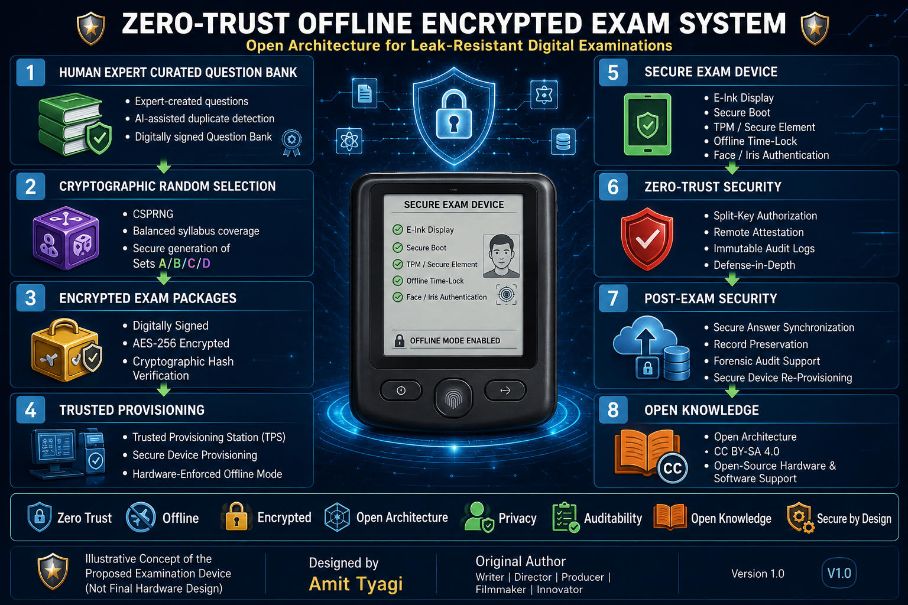

# zero-trust-offline-encrypted-exam-system
An Open Architecture for Leak-Resistant Digital Examinations
*A Defense-in-Depth Security Framework Supporting Open-Source Hardware and Software Implementations.*

---

# 🛡️ ZERO-TRUST OFFLINE ENCRYPTED EXAM SYSTEM

---

## 📖 Overview

The Zero-Trust Offline Encrypted Exam System (ZTOEES) is an open architecture designed to significantly reduce the risk of examination paper leaks through layered cryptographic security, secure hardware, offline operation, and complete auditability.

This architecture follows Zero-Trust principles and relies on transparency, cryptography, independent verification, and defense-in-depth rather than secrecy.

---

## 🎯 Objective

To eliminate question paper leaks by combining:

- Zero-Trust Security
- Offline Cryptography
- Secure Hardware
- Human-Expert-Curated Question Banks
- Cryptographically Secure Random Question Selection
- Complete Auditability

---

## 🔐 Key Features

- Human Expert Curated Question Bank
- Cryptographically Secure Random Selection (CSPRNG)
- Digitally Signed & Encrypted Examination Packages
- Trusted Provisioning Infrastructure
- Hardware-Enforced Offline Examination Mode
- Secure Hardware Root of Trust
- Multi-Layer Cryptographic Protection
- Student & Supervisor Authentication
- Anti-Leak Protection
- Anti-Cheating Features
- Complete Cryptographically Signed Audit Logs
- Privacy Protection
- Open Architecture

---

## 🏗️ System Architecture

The proposed architecture follows a secure end-to-end examination workflow:

1. Human Expert Curated Question Bank
2. Cryptographically Secure Random Question Selection (CSPRNG)
3. Digitally Signed & Encrypted Examination Packages
4. Trusted Provisioning Infrastructure (TPS)
5. Hardware-Enforced Offline Examination Devices
6. Zero-Trust Security Architecture
7. Post-Examination Security & Audit
8. Open Architecture (CC BY-SA 4.0)

---

## 📄 Whitepaper

**Download Version 1.0 Whitepaper**

📘 **[Zero-Trust-Offline-Encrypted-Exam-System-v1.0.pdf](Zero-Trust-Offline-Encrypted-Exam-System-v1.0.pdf)**

---

## 🖼️ Concept Illustrations

This repository includes conceptual illustrations explaining the proposed examination device and security architecture.

> **Disclaimer:** Illustrative Concept of the Proposed Examination Device (Not Final Hardware Design).

---

## 🌍 Open Knowledge

Released under the Creative Commons Attribution–ShareAlike 4.0 International (CC BY-SA 4.0) license to encourage global collaboration, implementation, independent verification, and continuous improvement.

Security should rely on transparency, cryptography, independent verification, and Zero-Trust principles—not on secrecy.

---

## 📜 License

Creative Commons Attribution–ShareAlike 4.0 International (CC BY-SA 4.0)

---

## 👤 Original Author

**Amit Tyagi**

Writer | Director | Producer | Filmmaker | Innovator

---

## 📚 Suggested Citation

Tyagi, Amit. (2026).

*Zero-Trust Offline Encrypted Exam System: An Open Architecture for Leak-Resistant Digital Examinations (Version 1.0).*

Licensed under CC BY-SA 4.0 International.

---

## 📌 Version

**Version:** 1.0

**Release Date:** 31 July 2026

---

© 2026 Amit Tyagi • Open Knowledge Project • CC BY-SA 4.0
